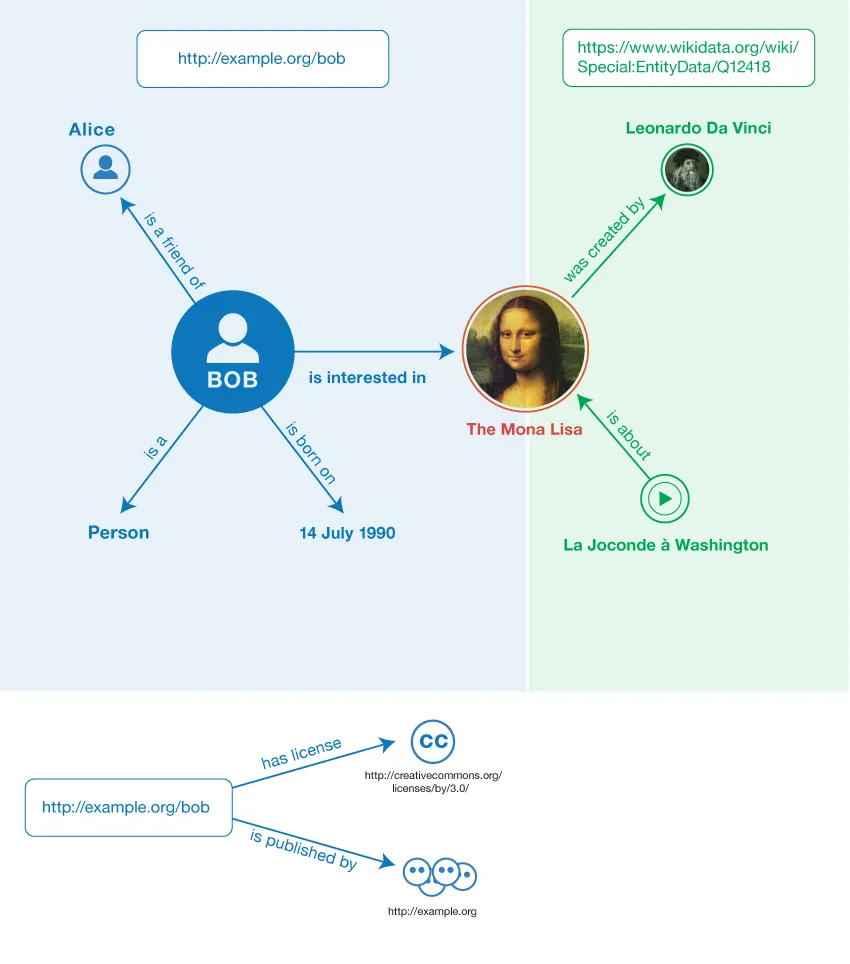

# Basic concepts of linked data

<br>

In 2009, the pioneer of the worldwide web, Tim Berners-Lee, presented a TED talk about linked data as the next phase of the internet, sometimes referred to as the Semantic Web. It is a vision of the evolution of the web of documents into the semantic web, where meaning is added through linked data so that, in addition to the current -human- users of the web, machines and computers can understand and interpret the meaning of data.

The Semantic Web allows more advanced and sophisticated search capabilities and machines to understand and process data like humans do.

Linked open data is a community project overseen by the W3C organisation and aims to enrich the Web by making open datasets even more accessible through the linked data method.

“Linked Open Data is Linked Data which is released under an open license, which does not impede its reuse for free.” Tim Berners-Lee

Tim Berners-Lee has proposed a 5-star system for rating the quality of open data on the Web, with Linked Open Data receiving the highest ranking:

⭐: data is openly available in some format (e.g. pdf); <br>
⭐⭐: data is available in a structured format(e.g. .xls); <br>
⭐⭐⭐: data is available in a non-proprietary structured format (.csv); <br>
⭐⭐⭐⭐: data follows W3C standards, like using RDF and URIs; <br>
⭐⭐⭐⭐⭐: all of the other, plus links to other Linked Open Data sources to provide a context. <br>

Linked data is structured data linked to other data by relationships or connections to make it more valuable through semantic searches. It expands on established Web technologies like HTTP and URIs. Still, it uses them to communicate information in a way that computers can read automatically rather than only serving web pages for human readers. The idea behind linked data is to turn the Internet into a global decentralized machine-readable database.




The figure above visualizes Resource Description Framework (RDF). RDF is a standard data model for representing and sharing information on the Web, based on the idea of using triples to represent data. A triple consists of three parts: a subject, a predicate, and an object.

In the context of linked data, subjects and objects refer to individual pieces of data, such as people, places, or things. Predicates refer to the connections or associations between different nodes, such as the fact that a person is the painter of a painting.

In the figure above, the subject http://example.com/person/alice represents Alice, the predicate http://example.com/vocab/isAFriendOf represents the relationship “is a friend of,” and the object http://example.com/person/bob represents Bob.


## Different types of serialization

Linked Data serialization formats are designed to encode structured data for interchange on the web, enabling the sharing and connecting of data across different sources. Besides Turtle, XML RDF, and N-Quads, several other serialization formats are commonly used in the context of Linked Data and RDF. 

In the frame of the Flanders Smart Data Spacen, for the moment, only the most commonly used serializations can be chosen in the configuration options of the building blocks. Each format offers unique features and is suitable for different use cases:


### JSON-ld

Configuration option building block: <i>```	application/ld+json```<i>

JSON-LD is a lightweight Linked Data format. It is easy for humans to read and write. It is based on the already successful JSON format and provides a way to help JSON data interoperate at Web-scale. JSON-LD is an ideal data format for programming environments, REST Web services, and unstructured databases such as Apache CouchDB and MongoDB.

```json
{
  "@context": "https://json-ld.org/contexts/person.jsonld",
  "@id": "http://dbpedia.org/resource/John_Lennon",
  "name": "John Lennon",
  "born": "1940-10-09",
  "spouse": "http://dbpedia.org/resource/Cynthia_Lennon"
}
```

### TURTLE (ttl)

Configuration option building block: <i>```	text/turtle```<i>

Turtle (Terse RDF Triple Language) is a serialization format for expressing data in the Resource Description Framework (RDF) that is designed to be compact and readable by humans. RDF is a standard model for data interchange on the web, which allows data to be linked to other data, enabling a wide range of web-based services. Turtle represents this linked data in a way that emphasizes simplicity and ease of understanding, using a syntax that closely resembles the way triples (subject, predicate, object) are naturally described.

In Turtle, each statement (or triple) consists of a subject, a predicate, and an object, followed by a period. It uses prefixes to shorten URIs (Uniform Resource Identifiers), making the data more compact and easier to read.

Example:

```turtle
@base <http://example.org/> .
@prefix rdf: <http://www.w3.org/1999/02/22-rdf-syntax-ns#> .
@prefix rdfs: <http://www.w3.org/2000/01/rdf-schema#> .
@prefix foaf: <http://xmlns.com/foaf/0.1/> .
@prefix rel: <http://www.perceive.net/schemas/relationship/> .

<#green-goblin>
    rel:enemyOf <#spiderman> ;
    a foaf:Person ;    # in the context of the Marvel universe
    foaf:name "Green Goblin" .

<#spiderman>
    rel:enemyOf <#green-goblin> ;
    a foaf:Person ;
    foaf:name "Spiderman" .
```

### N-Quads

Configuration option building block: <i>```application/n-quads```<i>

N-Quads is a serialization format designed for RDF (Resource Description Framework) datasets that extends the simplicity and effectiveness of the Turtle format to support named graphs within RDF data. Named graphs are a way of grouping sets of triples, allowing for the representation of multiple, discrete graphs within a single document. This feature is particularly useful for working with complex datasets that involve provenance, versioning, or different viewpoints within the same dataset, facilitating more granular control and organization of RDF data.

An N-Quads document consists of a series of statements, where each statement represents a triple (subject, predicate, object) similar to Turtle, with the addition of a fourth element that specifies the graph name (context) to which the triple belongs. Each statement in N-Quads is a line in the file, ending with a period, making it straightforward to parse and generate.


```turtle
<http://one.example/subject1> <http://one.example/predicate1> <http://one.example/object1> <http://example.org/graph3> . # comments here
# or on a line by themselves
_:subject1 <http://an.example/predicate1> "object1" <http://example.org/graph1> .
_:subject2 <http://an.example/predicate2> "object2" <http://example.org/graph5> .
```