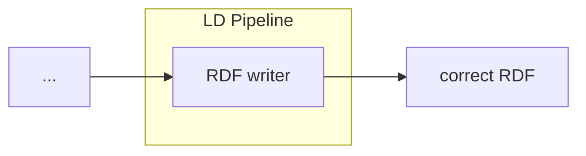

# RDF Adapter

<b>LDIO Component Name:</b> <i>`Ldio:RdfAdapter`</i> see [reference guide](https://informatievlaanderen.github.io/VSDS-Linked-Data-Interactions/ldio/ldio-adapters/ldio-rdf-adapter)  
<b>Apache Nifi Component Name:</b> <i>`
RDF serialisation Processor` </i> see [reference guide]()

As the most basic Adapter of the LDI Core Building Blocks, the RDF Adapter will take in an RDF string and convert it 
into an internal Linked Data model.  

## Notes

This Adapter only supports valid RDF mime types

 

An LDIO wrapper component for the [LDI RDF Adapter building block](../../core/ldi-adapters/rdf-adapter)

