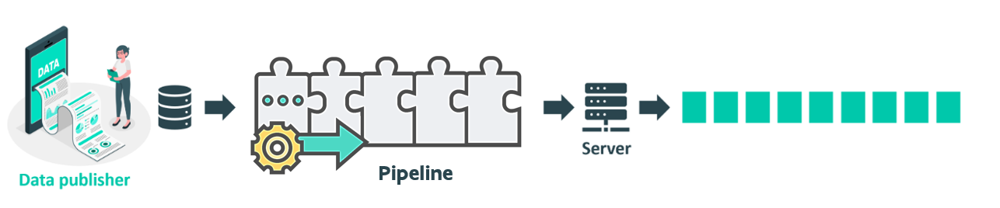

# Consuming Pipeline

 

As a <b>data consumer</b>, you want to access and utilize data from the Flanders Smart Data Space. This data is offered in the form of Linked Data Event Streams. This section aims to guide you through the process of creating the perfect consumption pipeline, providing a broad overview without delving into the complexities of each pipeline component. Armed with this foundational knowledge, you can seamlessly transition to the tutorials, ready to apply the essential concepts and background information to your data consumption tasks.

