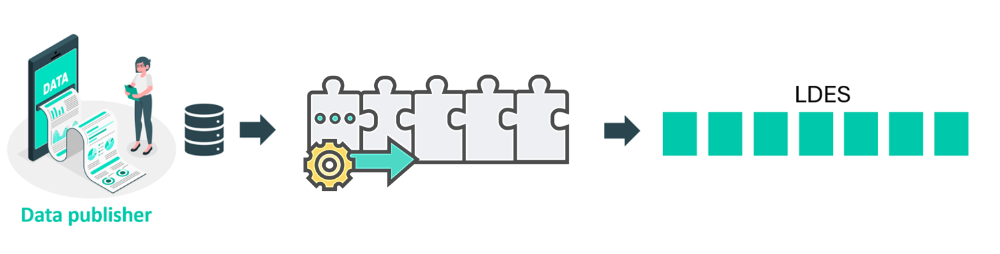

# General concept

To either publish your data with or access data from the Flanders Smart Data Space, setting up a pipeline is essential. You can kickstart this process instantly using open-source Java components that are ready to run in a docker container.

## Publisher pipeline

Are you a <b>data publisher</b> that wants to publish your data in the Flanders Smart Data Space as a Linked Data Event Stream (LDES)? In that case, it is necessary to configure a <b>publishing pipeline</b>. For instance, when a data publisher aims to distribute non-linked data as an LDES, a specifically configured publisher pipeline manages the entire process. Initially, an adapter component transforms the data into linked data. Subsequently, a transformer component converts the geometry into WKT format. Once the data is prepared for publication, it is transmitted to the LDES server using an HTTP-out component. It's important to note that the LDES server is not part of the pipeline; rather, it functions as a separate VSDS building block. For effective data publication, two services need to be deployed.

## Consuming pipeline

Are you a <b>data consumer</b> eager to delve into your first LDES experience? Setting up a dedicated <b>consumer pipeline</b> is once again essential. For instance, if a data user intends to access data from an LDES and store it in a database (such as GraphDB), they will need to establish a consuming data pipeline. Initially, the configuration of the LDES client component is required. This component, an integral part of the data pipeline, sequentially retrieves each LDES member and forwards them through the process. Following this, a Repository Materializer component must be integrated into the pipeline to enable the writing of LDES members to the GraphDB.

## Intermediary pipeline

As a <b>data intermediary</b>, your objective is to collect LDES streams and then release a revamped, enriched LDES data stream. The capability to utilize data processing techniques for cleaning, restructuring, or augmenting the initial datasets requires the establishment of a specialized LDES consumption pipeline. Your role involves implementing a resilient and scalable pipeline that not only facilitates an uninterrupted data flow but also aligns with Linked Data principles, thereby transforming your enhanced LDES stream into a crucial resource within the data ecosystem.
