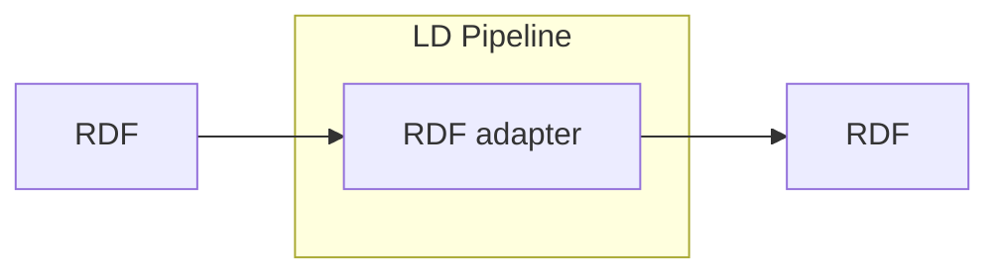

# RDF Adapter

<b>LDIO Component Name:</b> <i>`Ldio:RDFAdapter`</i> see [reference guide]()  
<b>Apache Nifi Component Name:</b> <i>`
RDF serialisation Processor` </i> see [reference guide]()

As the most basic Adapter of the LDI Core Building Blocks, the RDF Adapter will take in an RDF string and convert it into another RDF serialisation. Following RDF serializations are supported:

RDF/XML, Turtle (Terse RDF Triple Language), N-Triples, N-Quads, JSON-LD (JSON for Linked Data), RDFa (RDF in attributes).

More information about RDF serializations can be found [here](/basic/1_linked_data#different-types-of-serialization)

