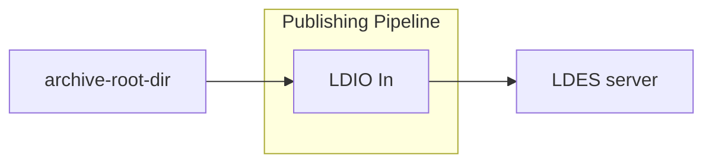

#  Archive file in

<b>LDIO Component Name:</b> <i>`Ldio:LdioArchiveFileIn`</i> see [reference guide]()  
<b>Apache Nifi Component Name:</b> <i>`ArchiveFileIn` </i> see [Apache Nifi reference guide]()

 

The LDIO Archive File In is used to read models from files and feed them to the pipeline.
Please refer to the [core documentation](../../core/ldi-inputs/file-archiving.md) for more information.

 

This component traverses all directories in the archive in lexical order and reads the members in lexical order as well.

Example expected structure:
- archive
  - 2022
    - 01
      - 01
        - member-1.nq
        - member-2.nq
        - ...
      - 02
        - member-122.nq
        - ...
