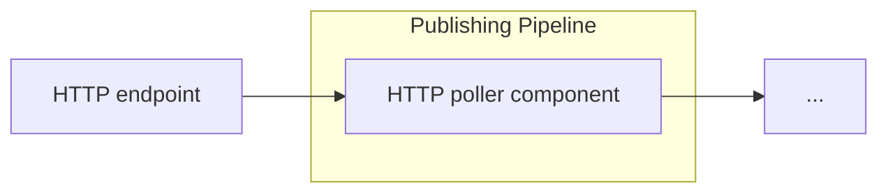

# LDIO HTTP In Poller

<b>LDIO Component Name:</b> <i>`Ldio:LdioHttpInPoller`</i>see [reference guide]()
<b>Apache Nifi Component Name:</b> <i>`InvokeHTTP`</i> see [reference guide]()

 

The LDIO HTTP In Poller is a basic HTTP Poller that will poll a target URL on a specified interval. This component fetches data from an HTTP endpoint at a configured interval.

It is designed to process input in various content types, including XML (text/xml, application/xml), JSON (application/json), and RDF (text/turtle, application/ld+json, application/n-quads, application/n-triples, application/rdf+xml).

The expected output of the component is in these same formats, supporting XML, JSON, and RDF content types.

