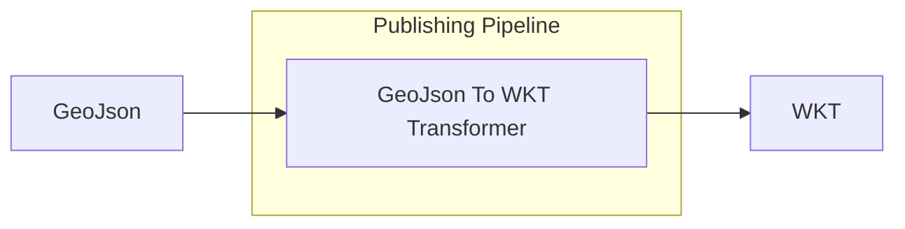

# GeoJson to Wkt Transformer

<b>LDIO Component Name:</b> <i>`Ldio:GeoJsonToWktTransformer`</i> see [reference guide](https://informatievlaanderen.github.io/VSDS-Linked-Data-Interactions/ldio/ldio-transformers/ldio-geojson-to-wkt)  
<b>Apache Nifi Component Name:</b> <i>`GeoJson-to-Wkt-Transformer`</i> see [Apache Nifi reference guide]()

 

The GeoJson to Wkt Transformer will transform any [GeoJson] statements (with predicate https://purl.org/geojson/vocab#geometry) to a [wkt string][WKT].

